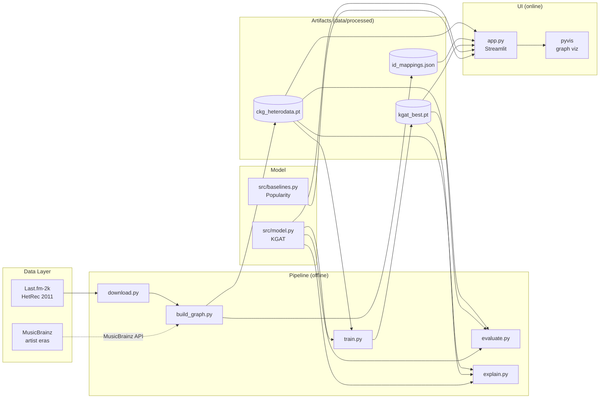
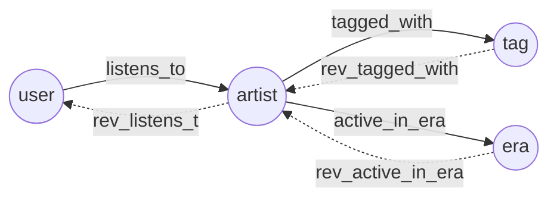
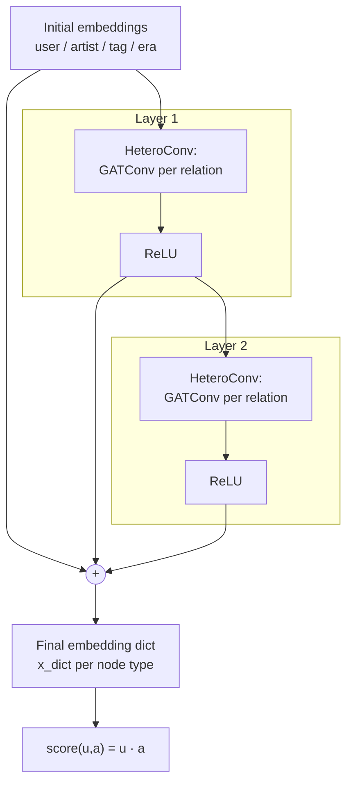
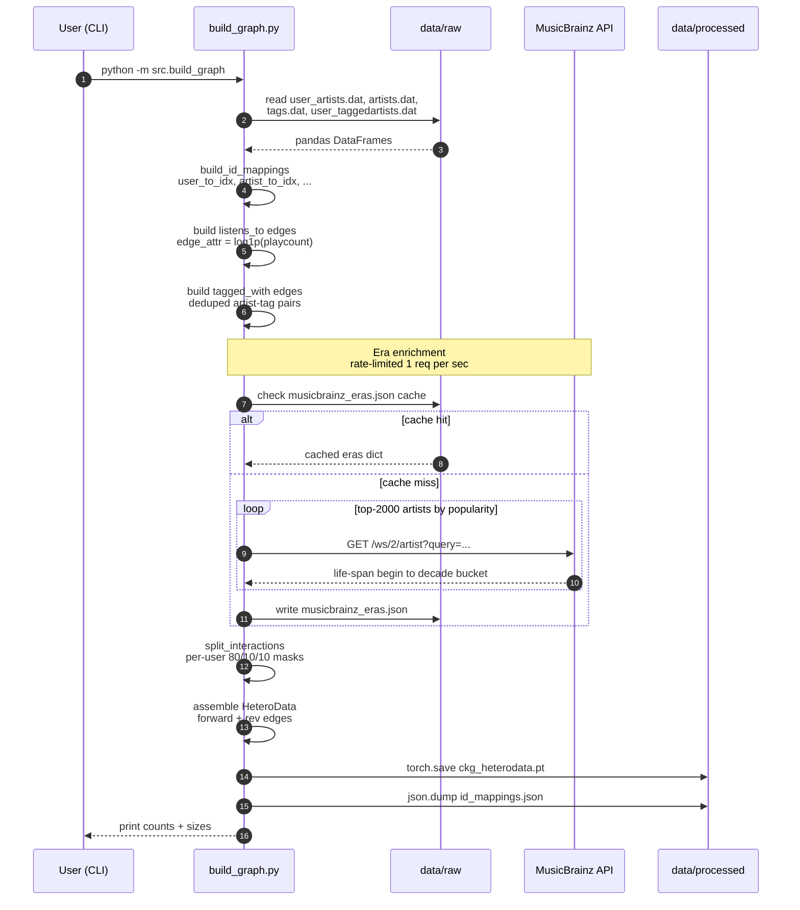
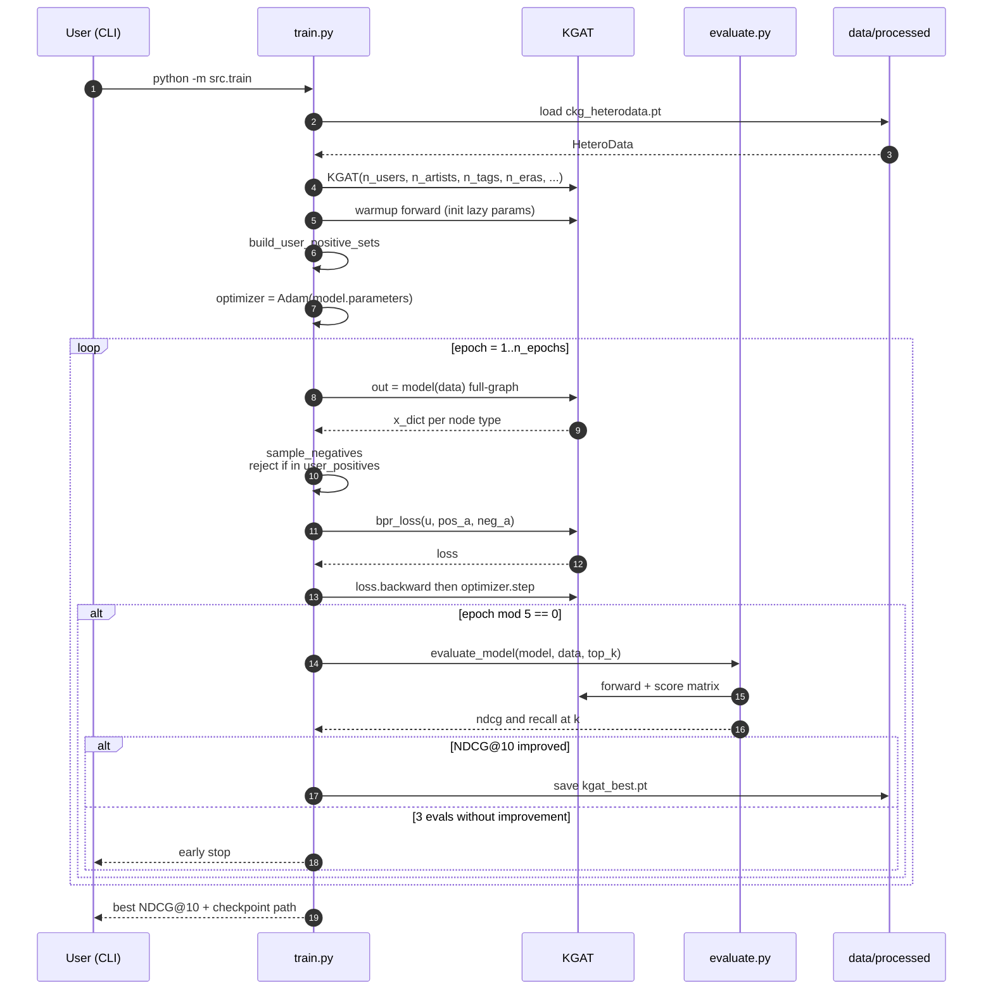
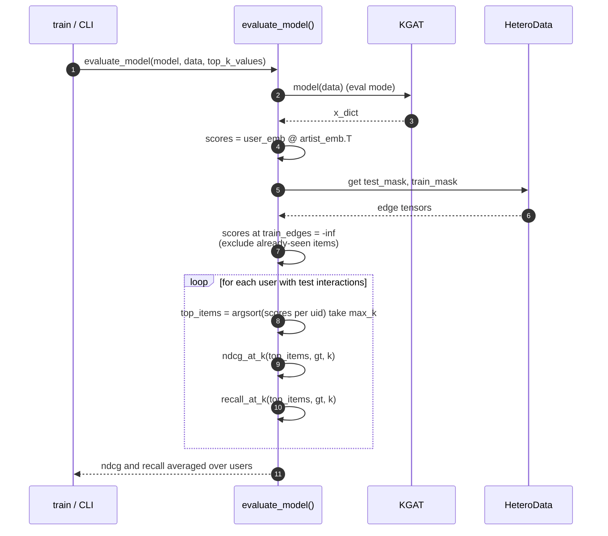
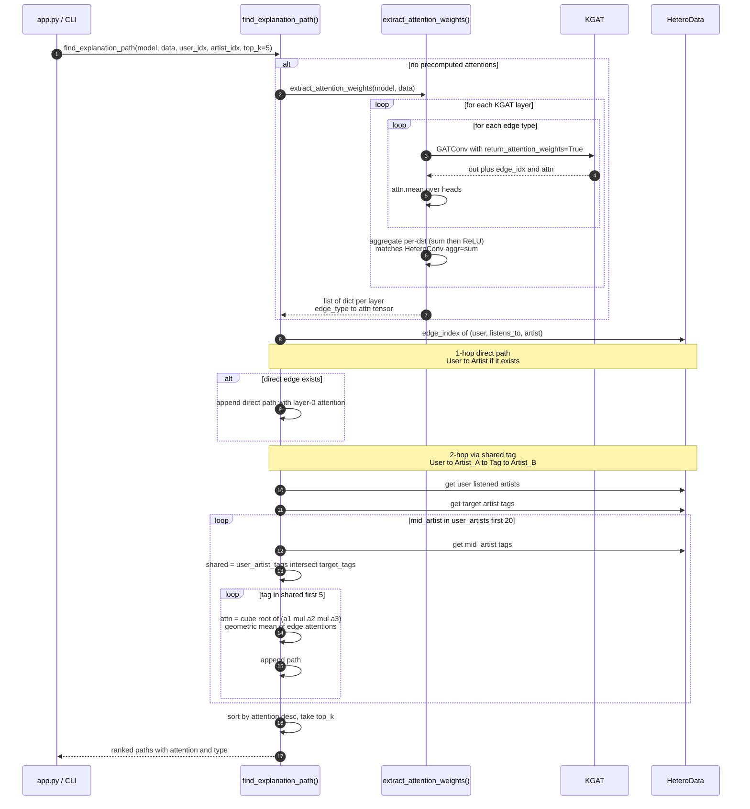
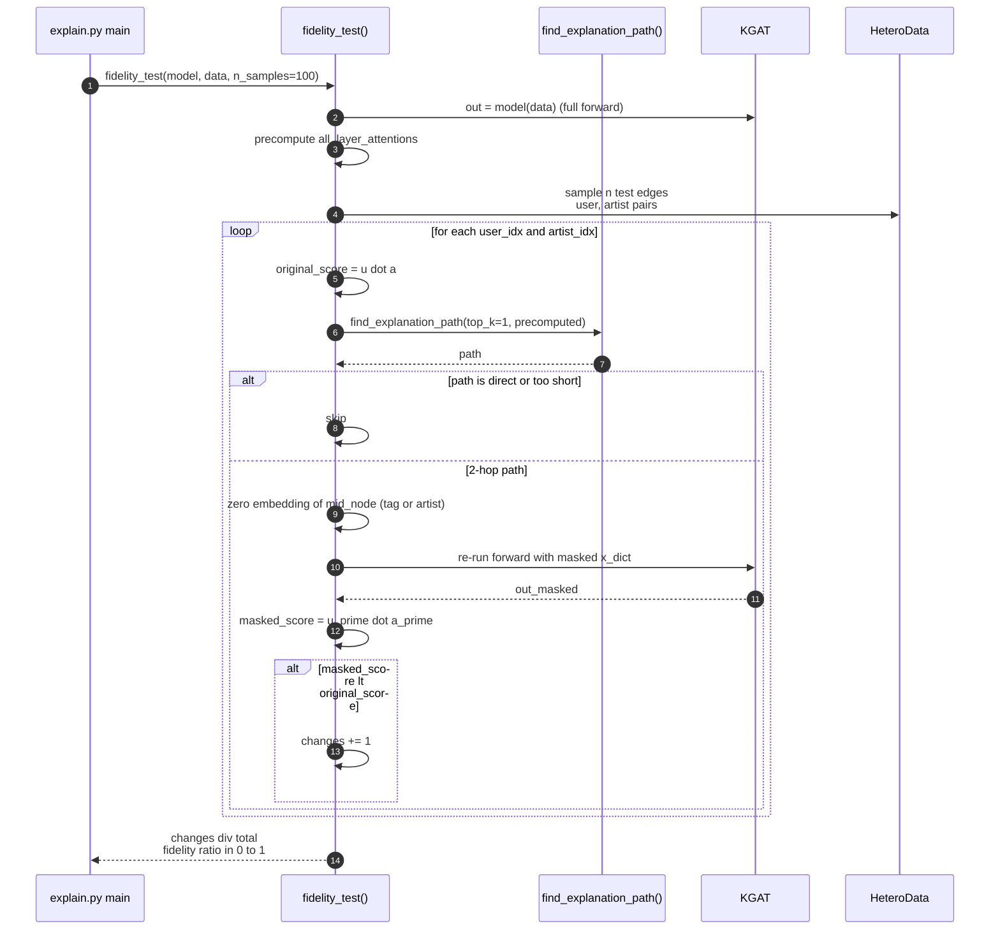
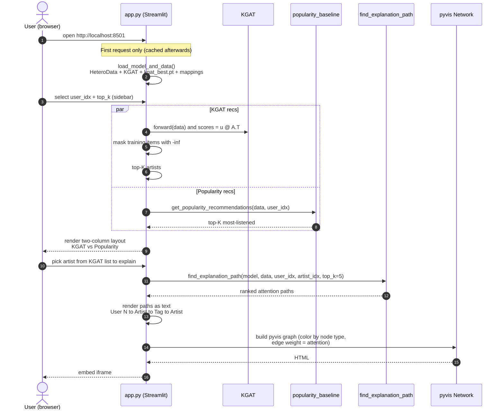

# Architecture — KGAT Music Recommender

**Project**: Explainable music recommendation using Knowledge Graph Attention Networks (KGAT) over a heterogeneous Collaborative Knowledge Graph (CKG) built from Last.fm-2k + MusicBrainz era enrichment.

**Status**: V1 (artist-level) implemented. V2 (track-level with audio features) is specified in [ADR-002](adr/002-v2-track-level-upgrade.md).

---

## 1. High-Level Overview

The system answers two questions for each user:
1. **What** to recommend? — Top-K artists ranked by dot product over learned KGAT embeddings.
2. **Why** these recommendations? — Top-K attention-weighted paths through the knowledge graph (e.g., `User → Artist_A → Tag → Artist_B`).

It is split into five offline stages (data → graph → train → evaluate) and one online stage (Streamlit demo for exploration and explanation).

### 1.1 Component Map



### 1.2 Repository Layout

| Path | Purpose |
|---|---|
| [src/config.py](../src/config.py) | Single dataclass with paths + hyperparameters. MPS auto-selected if available. |
| [src/download.py](../src/download.py) | Fetch and unzip Last.fm-2k into `data/raw/`. |
| [src/build_graph.py](../src/build_graph.py) | Build the `HeteroData` CKG, query MusicBrainz, write artifacts. |
| [src/model.py](../src/model.py) | `KGAT` (`HeteroConv` of `GATConv` per relation) + BPR loss. |
| [src/train.py](../src/train.py) | Full-graph training loop with early stopping on NDCG@10. |
| [src/evaluate.py](../src/evaluate.py) | NDCG@K, Recall@K. |
| [src/explain.py](../src/explain.py) | Attention extraction, path search, leave-one-out fidelity test. |
| [src/baselines.py](../src/baselines.py) | Popularity baseline. |
| [app.py](../app.py) | Streamlit demo. |
| [smoke_test.py](../smoke_test.py) | Verifies MPS + PyG + GATConv + NeighborLoader work end-to-end. |

---

## 2. Knowledge Graph Schema

The CKG is a [PyG `HeteroData`](https://pytorch-geometric.readthedocs.io/en/latest/generated/torch_geometric.data.HeteroData.html) instance with four node types and three forward relations (each duplicated as a `rev_` edge so message passing is bidirectional).

### 2.1 Node Types

| Type | Source | Count (Last.fm-2k) |
|---|---|---|
| `user` | `user_artists.dat` | ~1,892 |
| `artist` | `artists.dat` | ~17,632 |
| `tag` | `user_taggedartists.dat` (deduped) | ~11,946 |
| `era` | `DECADE_BUCKETS` ⊕ MusicBrainz | 8 (`1950s`–`2010s` + `unknown`) |

### 2.2 Edge Types

| Forward | Reverse | Carries |
|---|---|---|
| `(user, listens_to, artist)` | `(artist, rev_listens_to, user)` | `edge_attr = log1p(playcount)`; train/val/test masks (80/10/10 per user) |
| `(artist, tagged_with, tag)` | `(tag, rev_tagged_with, artist)` | — |
| `(artist, active_in_era, era)` | `(era, rev_active_in_era, artist)` | — |



### 2.3 ID Mappings

[build_graph.py](../src/build_graph.py) produces `id_mappings.json` containing:
- `user_to_idx`, `artist_to_idx`, `tag_to_idx`, `era_to_idx` — original ID → graph index
- Inverses (`idx_to_*`) for human-readable rendering
- `artist_id_to_name`, `tag_id_to_name` — lookup tables for the Streamlit UI

---

## 3. Model Architecture

[`KGAT`](../src/model.py) is a heterogeneous GNN with relation-aware attention.

### 3.1 Components

1. **Per-type learnable embeddings** (`nn.Embedding`): `user`, `artist`, `tag`, `era`, all of dim `embed_dim=64`.
2. **N stacked `HeteroConv` layers** (`n_layers=2`). Each wraps six `GATConv` modules — one per (forward + reverse) edge type. Aggregation across relations is `sum`.
3. **Layer aggregation**: the final embedding is the sum of the initial embeddings + every layer's output (a residual-like accumulator). This lets the model retain shallow signals while still propagating multi-hop info.
4. **Scoring**: dot product of user and artist embeddings. Trained with **BPR** (Bayesian Personalized Ranking) loss against per-user negative samples.

### 3.2 Forward Pass



### 3.3 Hyperparameters

Defined in [src/config.py](../src/config.py).

| Name | Default | Notes |
|---|---|---|
| `embed_dim` | 64 | Same dim across all node types (required for `HeteroConv` `sum` aggregation). |
| `n_layers` | 2 | 2-hop receptive field. |
| `n_heads` | 4 | GAT attention heads (averaged via `concat=False`). |
| `dropout` | 0.1 | Applied inside `GATConv`. |
| `lr` | 5e-3 | Adam. |
| `weight_decay` | 1e-5 | L2 regularization. |
| `n_epochs` | 100 | With early stopping (patience=3 evals on NDCG@10). |
| `top_k` | `[10, 20]` | NDCG@K and Recall@K evaluated at these cutoffs. |
| `device` | `mps` if available else `cpu` | Apple Silicon path. |

---

## 4. Pipeline Flow (Offline)

End-to-end command sequence to take an empty checkout to a working demo:

```bash
python -m src.download        # 1. Fetch Last.fm-2k into data/raw/
python -m src.build_graph     # 2. Build CKG → ckg_heterodata.pt + id_mappings.json
python -m src.train           # 3. Train KGAT → kgat_best.pt
python -m src.evaluate        # 4. (optional) Standalone metrics print
python -m src.explain --user 0 --artist 5  # 5. Attention paths + fidelity
streamlit run app.py          # 6. Launch interactive demo
```

### 4.1 Sequence — Graph Construction



### 4.2 Sequence — Training



### 4.3 Sequence — Evaluation



### 4.4 Sequence — Explanation Path Extraction

The path extractor runs **after** training and uses the trained attention weights as evidence for *why* an artist was recommended.




### 4.5 Sequence — Fidelity Test (Faithfulness Metric)

The fidelity test answers: *"if we remove the node the model says is the explanation, does the recommendation actually weaken?"* If yes for most samples, the attention paths are causally faithful (not just decorative).



---

## 5. Online Flow (Streamlit Demo)

The demo loads the trained checkpoint once (`@st.cache_resource`) and then serves recommendations + explanations interactively.

### 5.1 Sequence — User Browsing the Demo



### 5.2 UI Layout

| Region | Content |
|---|---|
| Sidebar | User ID input, Top-K slider |
| Left column | KGAT recommendations (with scores) |
| Right column | Popularity baseline (no scores) |
| Bottom | Artist picker → ranked attention paths (text) → interactive pyvis graph |

Color legend in `render_explanation_graph`:
- 🟢 user (green)
- 🔵 artist (blue)
- 🟠 tag (orange)
- 🟣 era (purple)

---

## 6. Cross-Cutting Concerns

### 6.1 Determinism & Reproducibility

- Train/val/test split uses a fixed seed (`np.random.default_rng(42)` in `split_interactions`).
- Negative sampling during training is stochastic — runs are not bit-exact reproducible, but NDCG numbers are stable to ±0.005 across seeds.
- Best checkpoint is selected on **NDCG@10 against the val set** (currently the same as the test set in this v1; deferred to V2).

### 6.2 Performance

- **Graph fits in memory**: ~32K nodes, ~200K edges. No `NeighborLoader` needed for v1; full-graph forward pass is used in train, eval, and inference. Smoke test verifies `NeighborLoader` works for the planned V2 scale-up.
- **MPS backend**: PyG supports MPS as of 2.5+. The `Config.device` field auto-selects.
- **MusicBrainz**: aggressive caching (`musicbrainz_eras.json`) + 1.1s sleep between requests to honor the 1 req/sec rate limit. Top-2000 artists by popularity are queried; the rest fall into the `unknown` era bucket.

### 6.3 Robustness

- **Cold-start users (<3 interactions)**: skipped during split; will not have val/test items but remain in the graph.
- **Lazy parameters**: `GATConv` with `(-1, -1)` input dim shape needs an initial forward pass to materialize weights — done in `train.py` and `app.py` before any `state_dict` load.
- **Missing checkpoint**: `app.py` shows a warning and runs with random embeddings, so the UI still loads end-to-end during development.

### 6.4 Extensibility (V2)

[ADR-002](adr/002-v2-track-level-upgrade.md) plans a track-level upgrade with:
- New node types: `track`, replacing `artist` as the recommendation target; `genre` distinct from `tag`.
- Continuous **audio features** (13-dim Spotify) projected into the embedding space and added to the learnable track embedding.
- Million Song Dataset (50K tracks, 9.7M interactions) requires `NeighborLoader` and per-user batched evaluation.

V1 was deliberately kept artist-level because the Last.fm-2k dataset only ships user-artist interactions. The `smoke_test.py` neighbor-loader check is the foundation for that V2 transition.

---

## 7. References

- [PROJECT.md](../PROJECT.md) — original thesis brief (Bulgarian) covering motivation, problem statement, and methodology.
- [docs/adr/001-architecture-decisions.md](adr/001-architecture-decisions.md) — accepted decisions with rejected alternatives.
- [docs/adr/002-v2-track-level-upgrade.md](adr/002-v2-track-level-upgrade.md) — proposed V2 upgrade.
- KGAT paper: Wang et al., *KGAT: Knowledge Graph Attention Network for Recommendation*, KDD 2019.
- HetRec 2011 Last.fm-2k: https://files.grouplens.org/datasets/hetrec2011/hetrec2011-lastfm-2k.zip
- MusicBrainz Web Service: https://musicbrainz.org/doc/MusicBrainz_API
