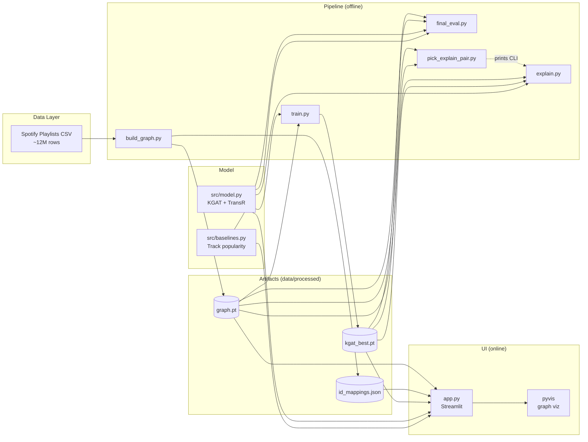
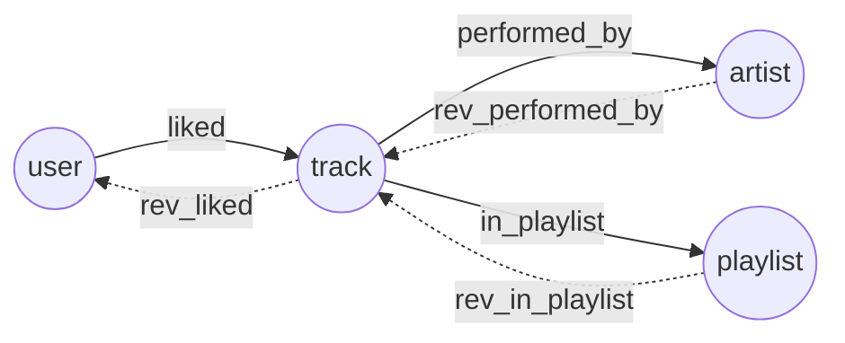
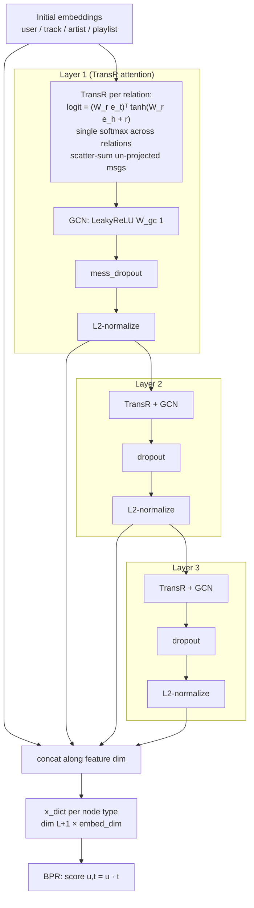
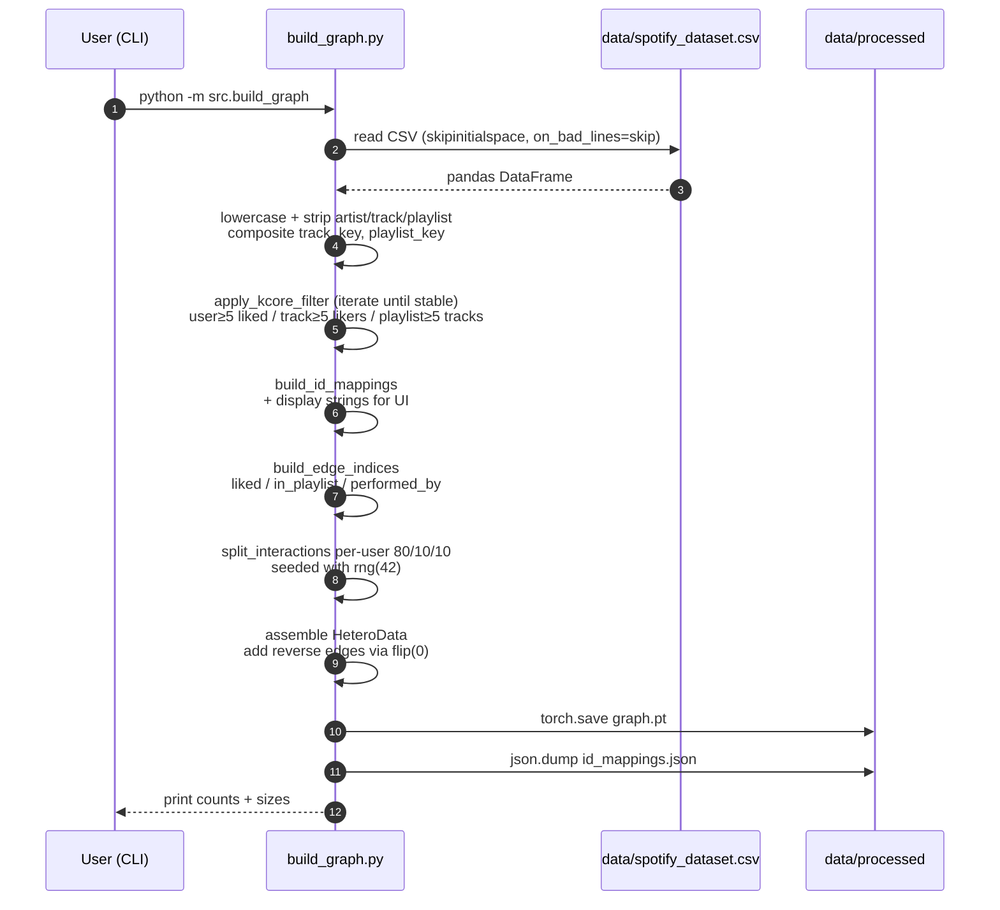
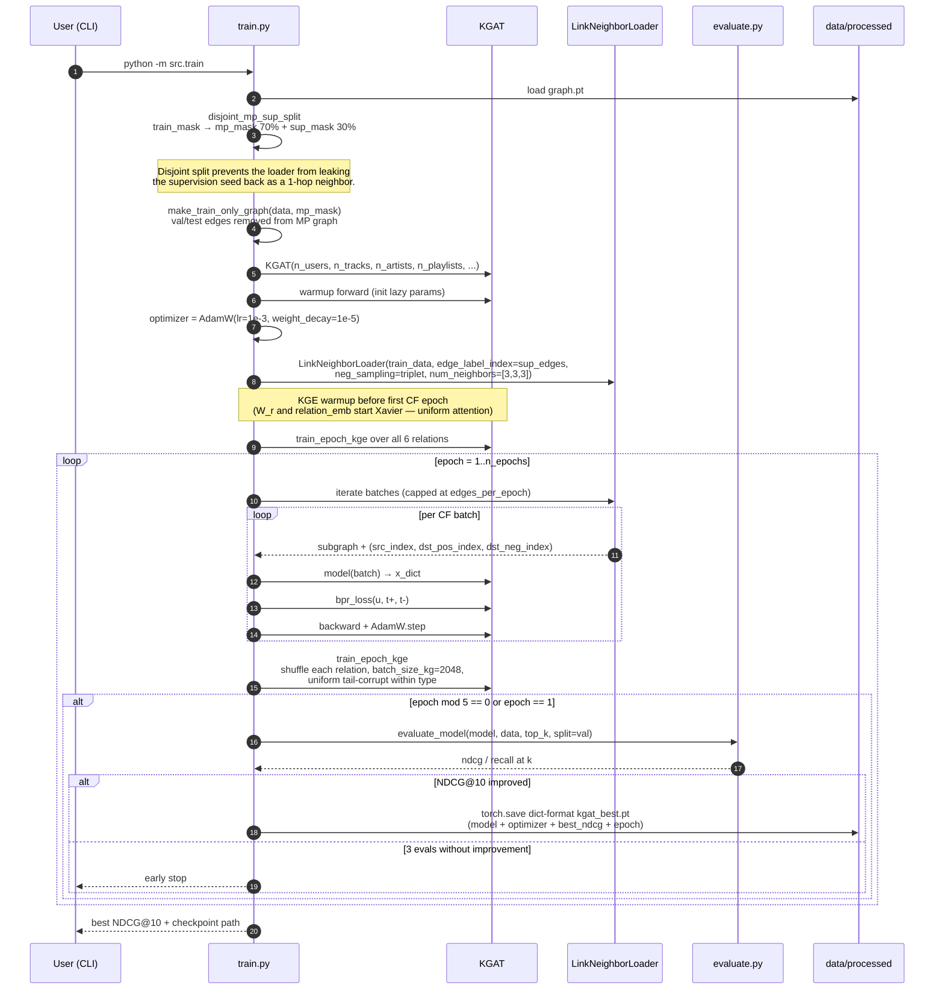
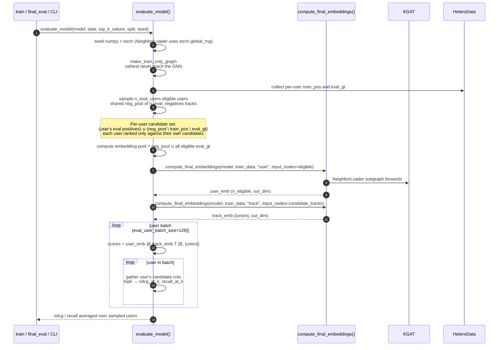
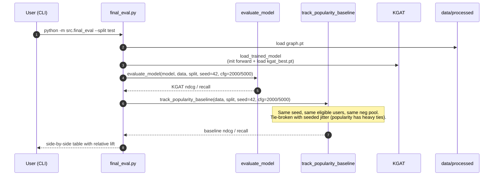
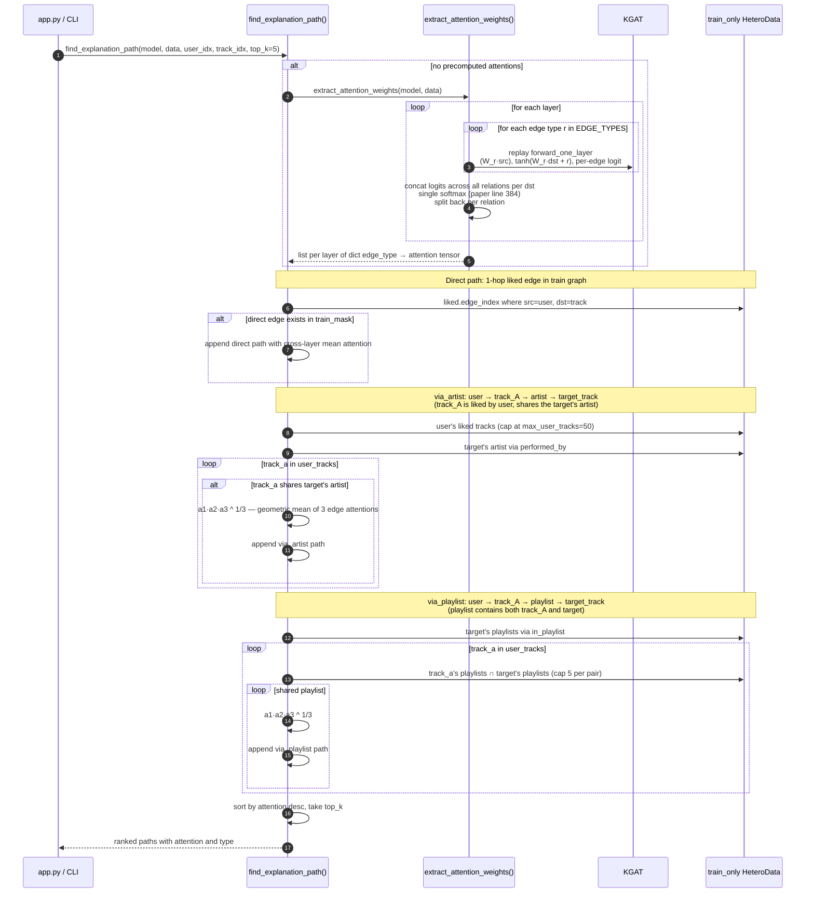
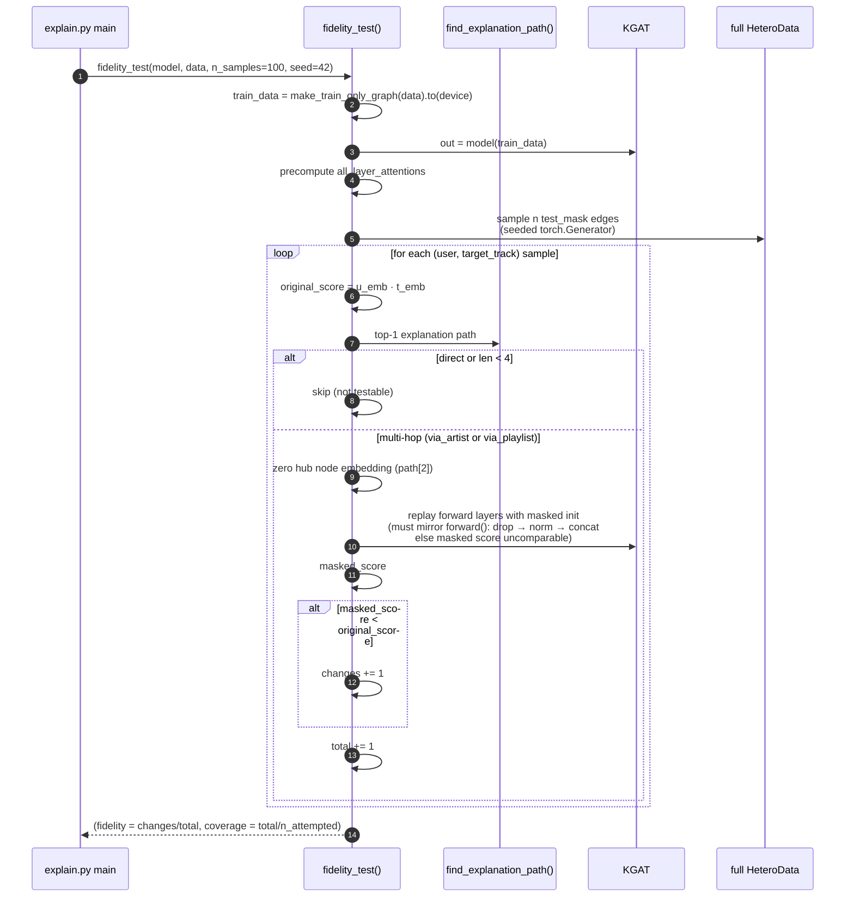
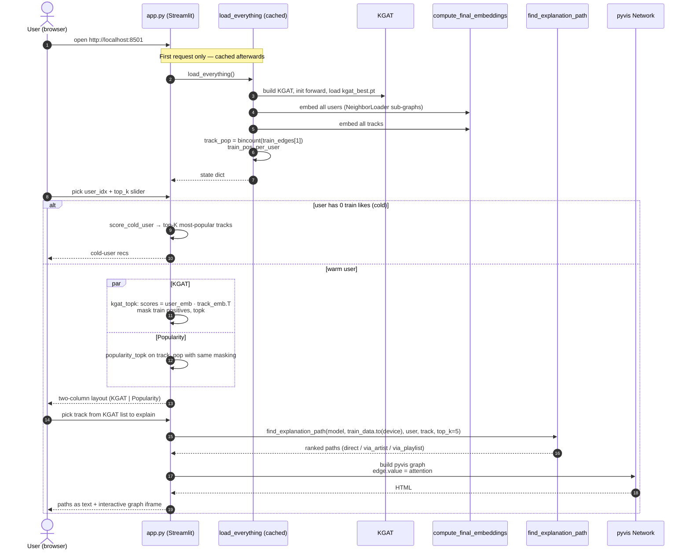

# Architecture — KGAT Music Recommender

**Project**: Explainable track-level music recommendation using a paper-faithful Knowledge Graph Attention Network (KGAT) over a heterogeneous Collaborative Knowledge Graph built from the [Spotify Playlists dataset](https://www.kaggle.com/datasets/andrewmvd/spotify-playlists).

---

## 1. High-Level Overview

The system answers two questions for each user:
1. **What** to recommend? — Top-K tracks ranked by dot product over learned KGAT embeddings.
2. **Why** these recommendations? — Top-K attention-weighted paths through the knowledge graph (e.g., `User → Track_A → Artist → Track_B` or `User → Track_A → Playlist → Track_B`).

Pipeline split: five offline stages (data → graph → train → final eval → explain) and one online stage (Streamlit demo).

### 1.1 Component Map



### 1.2 Repository Layout

| Path | Purpose |
|---|---|
| [src/config.py](../src/config.py) | Single dataclass with paths + hyperparameters. Auto-selects `cuda`/`mps`/`cpu`. |
| [src/build_graph.py](../src/build_graph.py) | Load CSV, K-core filter, build `HeteroData`, write artifacts. |
| [src/model.py](../src/model.py) | Paper-faithful `KGAT`: TransR attention, KGE triplet loss, BPR loss. |
| [src/train.py](../src/train.py) | `LinkNeighborLoader`-based training; alternating CF/KGE phases. |
| [src/evaluate.py](../src/evaluate.py) | Sampled-metrics NDCG@K and Recall@K under per-user candidate sets. |
| [src/baselines.py](../src/baselines.py) | Track-popularity baseline (same protocol as `evaluate.py`). |
| [src/final_eval.py](../src/final_eval.py) | Thesis-quality eval: KGAT vs. baseline, larger samples, side-by-side. |
| [src/pick_explain_pair.py](../src/pick_explain_pair.py) | Auto-pick a `(user, track)` pair with all 3 path types active. |
| [src/explain.py](../src/explain.py) | Attention extraction, path search, fidelity test. |
| [app.py](../app.py) | Streamlit demo. |
| [smoke_test.py](../smoke_test.py) | Verifies forward + backward + `NeighborLoader` work end-to-end. |

---

## 2. Knowledge Graph Schema

The CKG is a [PyG `HeteroData`](https://pytorch-geometric.readthedocs.io/en/latest/generated/torch_geometric.data.HeteroData.html) instance with **four node types** and **three forward relations** (each duplicated as a `rev_` edge so message passing is bidirectional → 6 edge types total).

### 2.1 Node Types

| Type | Source | Approx Count (post-K-core) |
|---|---|---|
| `user` | `user_id` column | ~14K |
| `track` | deduped `(artistname, trackname)` lowercased | ~381K |
| `artist` | deduped `artistname` lowercased | ~62K |
| `playlist` | deduped `(user_id, playlistname)` lowercased | ~73K |

K-core filter (iterative until stable, see `apply_kcore_filter`): drop users with <5 liked tracks, tracks with <5 distinct likers, playlists with <5 tracks.

### 2.2 Edge Types

| Forward | Reverse | Carries |
|---|---|---|
| `(user, liked, track)` | `(track, rev_liked, user)` | Recommendation target. **Train/val/test masks (80/10/10 per user)**, deduped across the user's playlists. |
| `(track, in_playlist, playlist)` | `(playlist, rev_in_playlist, track)` | Playlist co-occurrence. |
| `(track, performed_by, artist)` | `(artist, rev_performed_by, track)` | One artist per track. |

**No `(user, owns, playlist)` edge.** Playlists are treated as content hubs, not user property. With L≥2 such an edge would let a user's held-out test track flow back into the user embedding through `user → owns → playlist → rev_in_playlist → track`, leaking the answer into evaluation.



### 2.3 ID Mappings

[build_graph.py](../src/build_graph.py) writes `id_mappings.json`:
- `user_to_idx`, `track_to_idx`, `artist_to_idx`, `playlist_to_idx` — original key → graph index.
- `track_display`, `artist_display`, `playlist_display` — original-casing strings for the Streamlit UI.

---

## 3. Model Architecture

[`KGAT`](../src/model.py) implements the paper-faithful Wang et al. KDD 2019 architecture: TransR attention + KGE Phase II loss + GCN aggregator.

### 3.1 Components

1. **Per-type learnable embeddings** (`nn.Embedding`): `user`, `track`, `artist`, `playlist`, all of dim `embed_dim=64`.
2. **Per-relation projection `W_r ∈ ℝ^{R × D × K}`** and relation vector `r ∈ ℝ^{R × K}`. `R=6` (one per directed relation; `EDGE_TYPES` ordering is the relation id). **Shared across layers** — paper has only one `trans_W`.
3. **L stacked custom KGAT layers** (`n_layers=3`) — replaces `HeteroConv(GATConv)`. Each layer:
   - For every directed edge `(s, rel, d)` with PyG dst as ego (paper `h`) and PyG src as neighbor (paper `t`):
     - `h_proj = W_r · e_h`, `t_proj = W_r · e_t`
     - `logit = (W_r e_t)ᵀ · tanh(W_r e_h + e_r)`  ← paper eq (6)
   - **Single softmax over all incoming edges to each ego, regardless of relation** (paper `kgat_paper.py:384`).
   - Aggregated message is the **un-projected** neighbor embedding `e_t` (paper line 316).
   - **GCN aggregator** (paper alternative): `agg = LeakyReLU(W_gc^(l) · scatter_sum)` — no residual.
   - Per-layer: **dropout → L2-normalize** (paper line 289 then 292) — order matters.
4. **Layer aggregation**: concat `[x^(0), x^(1), …, x^(L)]` per node. `x^(0)` is **un-normalized** (paper line 263); `x^(1..L)` are normalized. Final per-node embedding has dim `(L+1) × embed_dim = 256`.
5. **Phase I — CF (BPR)**: `score(u, t) = u · t`; loss `−log σ(s_pos − s_neg)` over `(u, t+, t-)` triplets.
6. **Phase II — KGE (TransR triplet)**: on raw embedding tables (no GNN forward), `score(h, t) = ‖W_r h + r − W_r t‖²`, loss `softplus(s_pos − s_neg)`. `W_r` and `relation_emb` are **shared with Phase I**, so KGE gradient directly shapes the attention coefficients.

### 3.2 Forward Pass



### 3.3 Hyperparameters

Defined in [src/config.py](../src/config.py).

| Name | Default | Notes |
|---|---|---|
| `embed_dim` | 64 | Same dim across all node types. |
| `n_layers` | 3 | Paper-recommended sweet spot. |
| `mess_dropout` | 0.1 | Per-layer message dropout (paper line 289). |
| `leaky_relu_slope` | 0.2 | GCN-aggregator slope (paper default). |
| `kge_dim` | 64 | TransR projection dim (== `embed_dim`). |
| `kge_reg` | 1e-5 | L2 on `(h_proj, t_pos_proj, t_neg_proj, r)`. |
| `batch_size_kg` | 2048 | KGE phase batch size. |
| `lr` | 1e-3 | AdamW. 10× the paper's 1e-4 (deliberate — our graph is ~17M edges). |
| `weight_decay` | 1e-5 | Decoupled L2 via AdamW. |
| `n_epochs` | 40 | Early stopping (patience=3 evals on NDCG@10). |
| `batch_size` | 1048 | CF phase (LinkNeighborLoader). |
| `edges_per_epoch` | 1,000,000 | Caps batches per epoch; decouples wall-clock from train-set size. |
| `num_neighbors` | `[3, 3, 3]` | NeighborLoader fan-out, one entry per layer. |
| `top_k` | `[10, 20]` | NDCG@K, Recall@K cutoffs. |
| `n_eval_users` | 500 | Sampled-eval users for early stopping. (`final_eval.py` overrides to 2000.) |
| `n_eval_negatives` | 1000 | Sampled-eval shared neg pool. (`final_eval.py` overrides to 5000.) |
| `device` | auto | `cuda` if available, else `mps`, else `cpu`. |

---

## 4. Pipeline Flow (Offline)

End-to-end command sequence to take an empty checkout to a working demo:

```bash
# 1. Manually download spotify_dataset.csv to data/ from Kaggle.
python -m src.build_graph                 # 2. CKG → graph.pt + id_mappings.json
python -m src.train                       # 3. Train KGAT → kgat_best.pt
python -m src.final_eval --split test     # 4. Thesis-quality numbers on test split
python -m src.pick_explain_pair           # 5. Auto-pick a (user, track) for explanation
python -m src.explain --user N --track M --fidelity-samples 100  # 6. Paths + fidelity
streamlit run app.py                      # 7. Interactive demo
```

### 4.1 Sequence — Graph Construction



### 4.2 Sequence — Training (CF + KGE alternation)



#### Why disjoint MP/supervision split

`LinkNeighborLoader` does **not** auto-strip supervision edges from the MP graph. If we use every train edge as both an MP edge AND a supervision seed, the loader samples the seed `(u, t+)` edge as a 1-hop neighbor of `u`, message passing aggregates `t+`'s embedding directly into `u`'s, and the model learns the trivial "I'm connected → score high" rule. BPR loss collapsed to ~0.06 from epoch 1 in early experiments.

**Fix**: deterministically split train edges 70/30 — 70% become the MP graph (`edge_index` the loader samples from), 30% become supervision-only seeds (`edge_label_index`, never appearing in the MP graph). KGE phase uses the **full** train_mask since it operates on raw embedding tables (no GNN forward, no leak risk).

### 4.3 Sequence — Sampled Evaluation



#### Why sampled metrics

Full-corpus eval over 14K users × 381K tracks is `~5.3B` scores per pass — infeasible in our wall-clock budget for the per-epoch eval that drives early stopping. The sampled protocol matches BPR/NCF/LightGCN convention: per-user candidate set = (user's eval positives) ∪ (shared neg pool, with the user's train positives and eval positives subtracted). Both KGAT and the popularity baseline use the **same seed, same eligible users, same neg pool**, so deltas are apples-to-apples.

For early-stopping: `n_eval_users=500`, `n_eval_negatives=1000` (~30 s per pass).
For thesis numbers: `final_eval.py` overrides to `2000 / 5000` (tighter confidence bands).

#### Current results

Both models scored under the same protocol (same eligible users, same per-user candidate sets, same seed=42). Baseline tie-broken with seeded uniform jitter so `torch.topk` doesn't deterministically advantage GT tracks by `track_id`.

| Split | Sample (users / negs) | Metric | KGAT | Popularity | Lift |
| --- | --- | --- | ---: | ---: | ---: |
| test | 500 / 1 000 | NDCG@10 | 0.6418 | 0.4469 | +43.6% |
| test | 2 000 / 5 000 | NDCG@10 | 0.3808 | 0.3079 | +23.7% |
| val | 500 / 1 000 | NDCG@10 (best, epoch 30) | 0.7002 | — | — |

### 4.4 Sequence — Final Evaluation (KGAT vs. baseline)



### 4.5 Sequence — Explanation Path Extraction



### 4.6 Sequence — Fidelity Test (Faithfulness)

The fidelity test answers: *"if we mask the hub node the model says is the explanation, does the recommendation actually weaken?"* Reports both **fidelity** and **coverage**:
- **Fidelity** = fraction of testable samples where masking lowered the score.
- **Coverage** = fraction of sampled test edges whose top-1 explanation was multi-hop (only those are testable; direct paths are skipped).

Reporting both lets the thesis distinguish "masking does change the score" from "we couldn't even mask".



---

## 5. Online Flow (Streamlit Demo)

The demo loads the trained checkpoint once (`@st.cache_resource`) and serves recommendations + explanations interactively.

### 5.1 Embedding strategy

Embedding the full corpus (~14K users × ~381K tracks) is the slow part — wrapped in `@st.cache_resource` so it pays the cost a single time per process. After that, per-user scoring is a single matmul: `user_emb[uid] @ track_emb.T`, then top-K with the user's train positives masked.

Streamlit + MPS NeighborLoader are incompatible (`aten::_convert_indices_from_coo_to_csr` not implemented for MPS), so the demo auto-picks `cuda` if available, else `cpu`.

### 5.2 Sequence — User Browsing the Demo



### 5.3 UI Layout

| Region | Content |
|---|---|
| Sidebar | User index input, Top-K slider, user key + train-likes count |
| Left column | KGAT recommendations (with scores) |
| Right column | Popularity baseline (no scores) |
| Bottom | Track picker → ranked attention paths (text) → interactive pyvis graph |

Color legend in `render_explanation_graph`:
- 🟢 user (green)
- 🔵 track (blue)
- 🟠 artist (orange)
- 🟣 playlist (purple)

---

## 6. Cross-Cutting Concerns

### 6.1 Determinism & Reproducibility

- Train/val/test split: fixed seed (`np.random.default_rng(42)` in `split_interactions`).
- MP/sup split: fixed seed (`torch.Generator().manual_seed(42)` in `disjoint_mp_sup_split`).
- Eval: seeds **both** numpy (user/neg_pool sampling) AND `torch.manual_seed` (NeighborLoader uses the torch global RNG). Without both, two runs with the same `seed` produced different sub-graphs and different NDCG.
- Popularity baseline: seeded jitter (~1e-6) breaks ties uniformly so `torch.topk` doesn't deterministically advantage GT tracks by `track_id` ordering.
- KGE negative sampling and CF triplet sampling are stochastic; metric variance ~±0.005 across seeds.

### 6.2 Performance

- **Graph scale**: ~17M edges across 6 directed relations; full-graph forward OOMs on MPS. `LinkNeighborLoader` (training) and `NeighborLoader` (eval) sample sub-graphs with fan-out `[3, 3, 3]`.
- **Per-epoch wall-clock cap**: `edges_per_epoch=1M` decouples wall-clock from train-set size. Each train edge gets ~3 gradient touches per epoch on average.
- **Loss accumulation on-device**: per-batch `.item()` forces an MPS sync that drains the kernel queue. Loss is accumulated as a 0-dim tensor on-device, `.item()` is called only at heartbeat (every 50 batches) and end-of-epoch.
- **Resume**: `--resume` loads model weights, optimizer state, `best_ndcg`, and last epoch from the dict-format checkpoint; legacy raw-state-dict checkpoints fall back to weights-only with an automatic backup.

### 6.3 Robustness

- **MPS limitation**: `aten::_convert_indices_from_coo_to_csr` not implemented. `NeighborLoader` is fed CPU tensors; only model + train_data are moved to the device. `app.py` and `pick_explain_pair.py` skip MPS entirely (auto-pick cuda/cpu).
- **Cold-start users**: filtered out by K-core; never appear in the training graph. `app.py` falls back to `score_cold_user` (track popularity) when a selected user has 0 train likes.
- **Lazy parameters**: KGAT no longer uses `GATConv`, so there are no lazy `(-1, -1)` shapes; explicit `torch.empty(R, D, K)` sizing throughout.
- **Missing checkpoint**: `app.py` shows an error and stops; `final_eval.py` raises `FileNotFoundError`; `explain.py` warns and continues with random weights (so the path-search code is still exercisable during development).

### 6.4 Paper-Faithfulness Trail

The implementation deliberately mirrors the original KGAT paper (Wang et al. KDD 2019). Stage-by-stage notes are inline in `src/model.py` and `src/train.py`; the high-level deviations are:

| Decision | Paper | This implementation | Why |
|---|---|---|---|
| Aggregator | Bi-interaction OR GCN | **GCN only** | Simpler; paper reports comparable results. |
| Attention cache | `update_attentive_A` (sparse N×N, recomputed per epoch) | Per-batch attention inside `forward_one_layer` | `LinkNeighborLoader` rebuilds sub-graphs per batch — caching impossible. Trade: every CF batch pays the attention compute cost; we get exact paper semantics with no staleness. |
| Node dropout | Declared but `node_dropout_flag = False` by default | Not implemented | Paper never uses it. |
| LR | 1e-4 | **1e-3** | Our graph is ~17M edges; 1e-4 too slow for the wall-clock budget. |
| Optimizer | Adam | **AdamW** | Decoupled weight decay matches paper's effective L2-on-parameters. |
| KGE relations | All KG relations | **All 6 directed relations including (user, liked, track)** | Excluding interact starves `W_r[interact]` and `relation_emb[interact]` of direct gradient signal. |

### 6.5 Extensibility

- **Bi-interaction aggregator**: paper alternative to the GCN aggregator; orthogonal to TransR + KGE; could be A/B'd.
- **Temporal split**: dataset has no timestamps. Per-user random 80/10/10 is the best available proxy.

---

## 7. References

- KGAT paper: Wang et al., *KGAT: Knowledge Graph Attention Network for Recommendation*, KDD 2019.
- Reference implementation: https://github.com/xiangwang1223/knowledge_graph_attention_network (`Model/KGAT.py` referenced inline as `kgat_paper.py`).
- Spotify Playlists dataset: https://www.kaggle.com/datasets/andrewmvd/spotify-playlists
